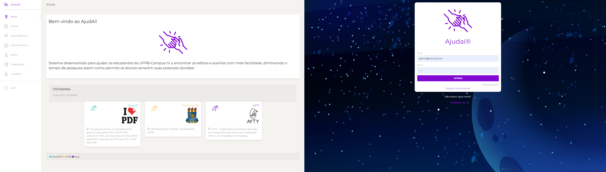

# Ajudai
<div align="center">
    
    
</div>

# Plataforma para ajudar os alunos.

![version][version-badge] ![Idioma][idioma] ![status][status-emprogresso]


### Para rodar localmente este projeto é necessário:
#### Clonar o repositório
```javascript
git clone git@github.com:TomCosta/ajudai.git
``` 
#### Entrar na pasta do projeto
```javascript
cd ajudai
``` 
### Reinstalar as dependências
```bash
npm install
```
### Rodar localmente no navegador
```bash
ng s -o
```
#
## Se não tiver o Angular instalado

Use o comando abaixo:

```bash
npm install -g @angular/cli
```

Então para rodar, cd `ajudai`. 
Rodar localmente no navegador `ng serve`.

```bash
ng serve
```

# Extras
## Gerar componentes, pipes, services, etc.
Use o comando abaixo:
```javascript
ng g component `component-name` to generate a new component
```
### Você também pode criar outros, escolha entre:
```javascript
ng g `directive|pipe|service|class|guard|interface|enum|module`
```


[CHANGELOG]: ./CHANGELOG.md
[version-badge]: https://img.shields.io/badge/version-1.0.0-blue.svg
[license-badge]: https://img.shields.io/badge/license-MIT-blue.svg
[status-emprogresso]: https://img.shields.io/badge/status-Em%20progresso-blueviolet
[idioma]: https://img.shields.io/badge/idioma-Portugu%C3%AAs-800060
[Super Team]: https://github.com/TomCosta/angularMarket/blob/master/super_team_80x80.jpg